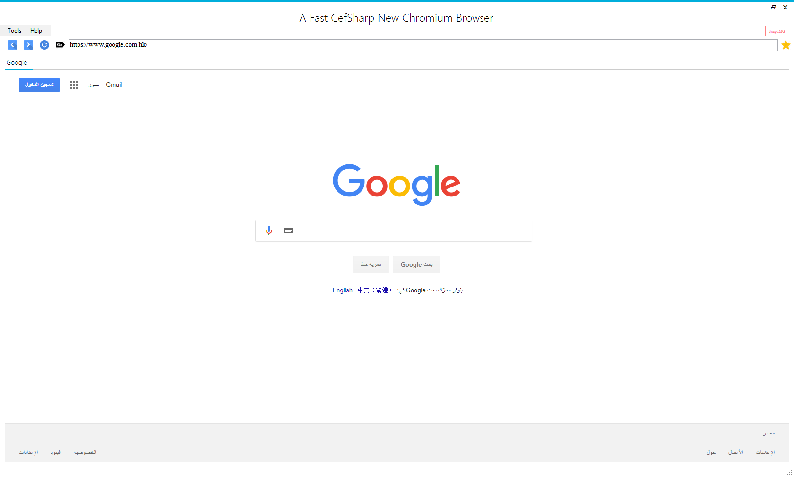

## A Fast CefSharp New Chromium Browser Microsoft Windows OS Desktop

[](http://cefsharp.github.io/ "CefSharp - Embedded Chromium for .NET")

[](https://ci.appveyor.com/project/cefsharp/cefsharp/branch/master)
[](http://www.nuget.org/packages/CefSharp.WinForms/)

***
> ## ***```The Prerequisites are Required: ```***
> ## ```Microsoft .NET Framework 4.7```
 ***
 [](https://github.com/Create-Browser/AFastCefSharpNewChromiumBrowserDesktop/releases/tag/Debug)
 
> **If you have a question, ask it on [StackOverflow](http://stackoverflow.com/questions/tagged/cefsharp) or use [ceforum](http://magpcss.org/ceforum/) (for questions specific to CEF).**

> # Please Now

> **c# Cefsharp Winforms TabControl - how to get popup - Popup Windows New**

> **c# Cefsharp Winforms TabControl - how to get favicon of visited site - favicon.ico + Add icons to web browser tabs**

> **c# Cefsharp winforms TabControl - how to get Add New Tab Button (+) &|& Add Cancel Tab Button (X)**

> **c# Cefsharp winforms TabControl - how to get Loading of visited site**

> **c# Cefsharp winforms TabControl - how to get BookmarksForm + Add link Bookmark**

> **c# Cefsharp winforms - how to get Cookie + CachePath**

> ### **Custom System Menu | MyCustomChromeDevToolsSystemMenu**

> **c# Cefsharp winforms - how to get SystemMenu + ChromeDevToolsSystemMenu**

> ### **Custom Menu Handler | MyCustomMenuHandler**

> **c# Cefsharp Winforms TabControl - how to get Save Download image + Save As Downloading image**
